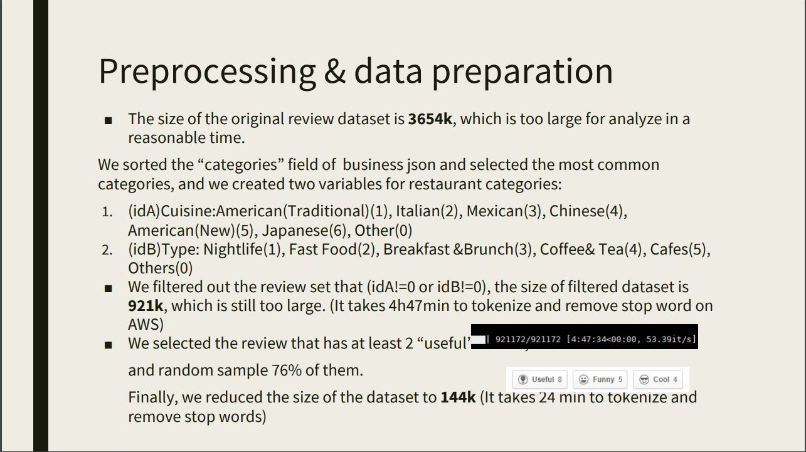
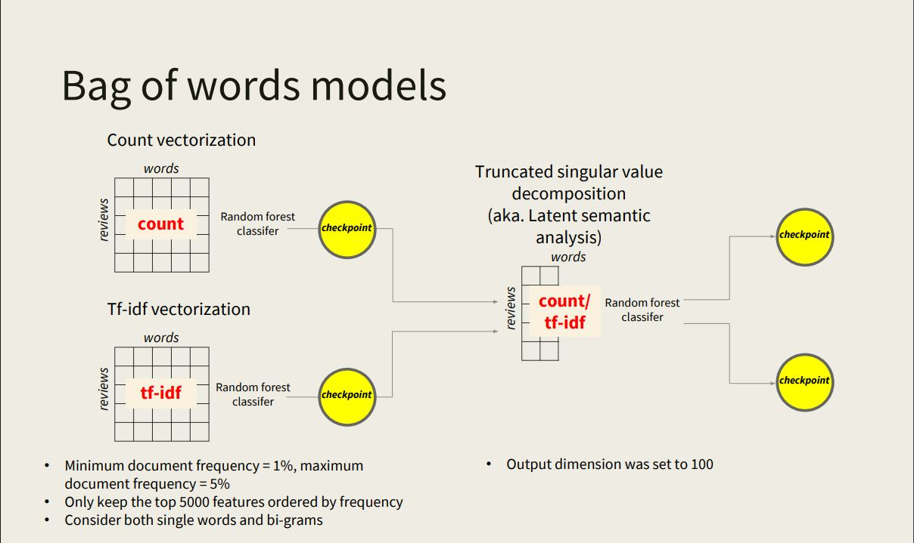
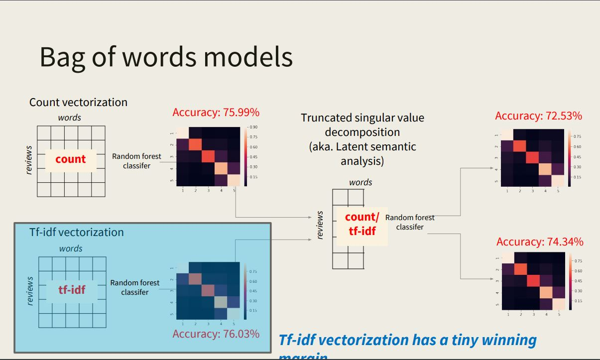
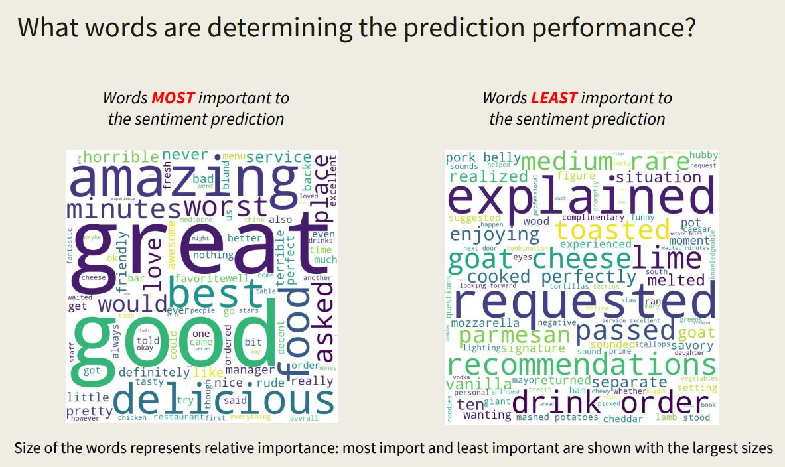
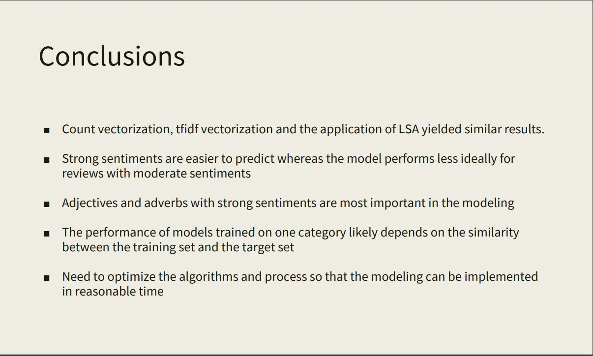

# Yelp review sentiment modeling

Yelp review sentiment modeling by NLTK and scikit-learn, Final Project for NLP Fall 2018@GWU

Author:
Li Du, Xiaochi (George) Li

[Read our report](./Report.pdf)   
[Read our presentation PPT](./Presentation.pdf)   
[Read our code](./bag_of_words_model_V3.ipynb)   

## Brief Info:
In the project, we analyzed reviews from Yelp using a series of natural language processing techniques and also tried to predict the sentiments from these reviews represented as the star level using the review texts. Based on the findings from the processing and predictive modeling, we also tried to answer a few research questions regarding the performance of the models as well as how different/similar the reviews are for each category.

### Preprocessing:

### Experiment Design

### Experiment Result

### Important Words

### Conclusion
